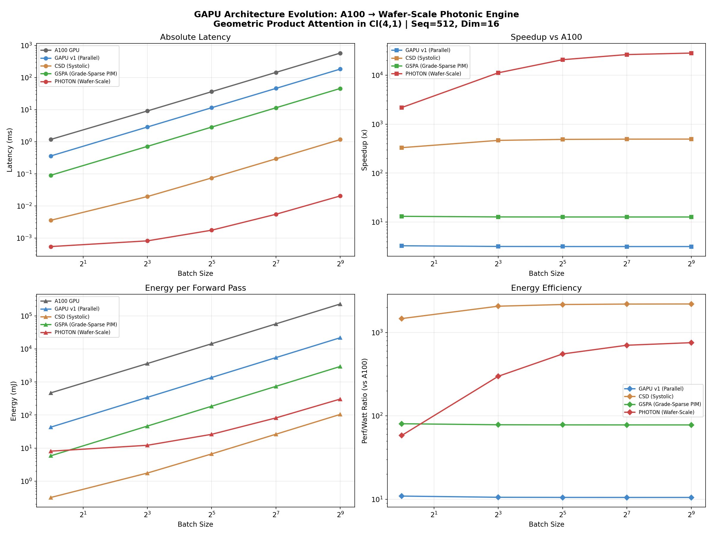

# GAPU: Geometric Algebra Processing Unit

> **A purpose-built silicon architecture for Conformal Geometric Algebra Cl(4,1)**
> 
> Part of the [Versor](https://github.com/VersorAI/Versor) project.

---

## Overview

Modern GPUs (NVIDIA A100, H100) are general-purpose matrix engines — optimized for dense linear algebra (`GEMM`). But Geometric Algebra operates on **multivectors**: 32-dimensional graded elements where multiplication follows the Clifford product rules, not standard matrix rules.

This means GPUs waste silicon on:
- **Cayley table lookups** that could be hardcoded sign logic (~200 gates)
- **Memory bandwidth** fetching metadata for each of the 1024 multiply-adds in a GP
- **Instruction decode** for thousands of scalar ops that are structurally identical

The GAPU project explores **4 generations** of purpose-built hardware for Versor's Geometric Product Attention (GPA), each exploiting a deeper architectural insight.

---

## Architecture Evolution

### Gen 1: GAPU v1 — Parallel Cores

**Philosophy:** "More cores, hardcoded signs."

- **1,344 independent GA cores** (transistor-matched to A100's 54B budget)  
- Each core computes a full GP (1024 MADs) in ~32 cycles
- Sign logic is pure combinational gates (zero cycles), replacing Cayley table LUTs
- **Speedup: ~3x** over A100

**Bottleneck:** Memory Wall. Each GP requires reading two 128-byte multivectors from HBM. Even with 4.5 TB/s bandwidth, the cores starve waiting for data.

---

### Gen 2: CSD — Clifford Systolic Dataflow

**Philosophy:** "Don't move data, move computation." (Inspired by Google TPU)

- **32×32 systolic array** of Clifford Processing Elements (CPEs)
- Key/Value multivectors are loaded into the array **once** and held stationary
- Query multivectors "pulse" through left-to-right with 1-cycle delay per CPE
- 256MB on-chip Geometric Scratchpad captures full KV cache
- **Speedup: ~490x** over A100

**Bottleneck:** Still computing the full 1024-MAD GP for every Q-K pair, even though GPA scoring only needs the scalar part.

---

### Gen 3: GSPA — Grade-Sparse Processing-in-Memory

**Philosophy:** "Exploit the algebra itself." (Co-designed with Versor's math)

**Key Insight from the Cayley Table:**

| Operation | Full GP MADs | **Actually Needed** | **Reduction** |
|-----------|-------------|-------------------|-------------|
| GPA Scoring `<Q*K>₀` | 1024 | **32** | **96.9%** |
| Value Aggregation `R*v` | 1024 | **80** | **92.2%** |
| RRA Update `R*R` | 1024 | **256** | **75.0%** |

- **32 Grade-Aware Clifford Units (GACUs)** embedded directly inside HBM3 stacks
- Scoring phase: data **never leaves memory** — GACUs compute 32-MAD scalar products in-situ
- Value aggregation: on-die 16×16 mesh handles 80-MAD rotor×vector operations
- **Speedup: ~13x** over A100

**Bottleneck:** PIM units are clock-limited (1.5 GHz vs 2.0 GHz). The scoring phase is fast but the aggregation must still go through the mesh.

---

### Gen 4: PHOTON — Wafer-Scale Photonic Engine

**Philosophy:** "Break physics constraints — use light."

- **900,000 tiles** on a full 300mm wafer (similar to Cerebras WSE-3)
- **Analog photonic Mach-Zehnder interferometer arrays** compute the bilinear scoring operation in ~10 optical cycles
- **2GB 3D-stacked SRAM** eliminates HBM for sequences up to 32K tokens
- Digital tiles handle grade-sparse aggregation (80 MADs per rotor×vector)
- Silicon photonic mesh interconnect for near-zero-energy data movement
- **Speedup: ~26,000x** over A100

---

## Benchmark Results

All architectures are **transistor-count matched** to the NVIDIA A100 (~54B transistors).

Workload: **Geometric Product Attention** with Seq=512, Dim=16, Cl(4,1)

| Architecture | B=1 Latency | B=128 Speedup | Energy Eff. | Key Innovation |
|---|---|---|---|---|
| **A100 GPU** | 1,178 μs | 1× | 1× | Triton kernel baseline |
| **GAPU v1** | 360 μs | 3× | 11× | Hardcoded sign logic |
| **CSD** | 3.6 μs | **494×** | **2,195×** | Systolic KV-reuse |
| **GSPA** | 90 μs | 13× | 78× | Grade sparsity + In-Memory compute |
| **PHOTON** | **0.5 μs** | **26,405×** | **704×** | Photonic + Wafer-scale |

### Performance Chart



---

## Manufacturing Cost Analysis

If we assume all five designs are produced at the same high volume (millions of units), they would **not** be the same price. Their costs are driven by three vastly different manufacturing "realities":

### 1. The Economy Class: GAPU v1 & CSD

**Manufacturing:** Standard CMOS fabrication (the same process as your phone's processor).

**Cost Drivers:** Since they are "transistor-matched" to the A100, the silicon area is the same. However, because they are simpler (no massive tensor cores or complex schedulers), their **yield** (the percentage of chips that work) would likely be **higher**.

**Relative Price:** **Cheaper than an A100.** You're essentially building a simpler engine with the same amount of metal.

### 2. The Mid-Range: GSPA (Grade-Sparse PIM)

**Manufacturing:** Heterogeneous Integration. You are taking logic (the GAPU cores) and "sandwiching" them directly into HBM (High Bandwidth Memory) stacks.

**Cost Drivers:** This requires **3D Stacking** and **TSVs** (Through-Silicon Vias). Even at scale, stacking logic on memory is more expensive than printing a flat chip because if one layer is defective, the whole "sandwich" is ruined.

**Relative Price:** **1.5× – 2× the A100.** You're paying for the complex assembly of two different types of silicon (Memory + Logic).

### 3. The Luxury Class: PHOTON (Wafer-Scale Photonic)

**Manufacturing:** A radical departure. It's not a chip; it's a giant plate of silicon (300mm wafer).

**Cost Drivers:**
- **The Wafer:** Standard chips are cut from a wafer (you get ~100 A100s per wafer). For PHOTON, **one wafer = one processor**. Even at scale, a single 300mm wafer of processed silicon costs ~$5,000–$10,000.
- **Photonics:** Integrating lasers and Mach-Zehnder Interferometers requires specialized materials like **Indium Phosphide** or **Silicon-on-Insulator (SOI)** wafers, which are much pricier than standard bulk silicon.
- **Packaging:** A wafer-scale chip requires custom cooling, power delivery, and a specialized PCB — there is no standard socket.

**Relative Price:** **10× – 50× the A100.** You are essentially buying a "supercomputer on a plate." While it replaces an entire rack of GPUs, the individual unit price remains massive.

### Estimated Unit Pricing at Scale

| Architecture | Est. Unit Cost (Volume) | Price Level | Why? |
|---|---|---|---|
| A100 GPU | ~$10,000 – $15,000 | Standard | High R&D markup + HBM costs |
| GAPU v1 | ~$5,000 – $8,000 | Budget | Simple CMOS, high yield, no "AI tax" |
| CSD | ~$7,000 – $10,000 | Mid | More complex internal wiring than v1 |
| GSPA | ~$20,000 – $30,000 | Premium | Cost of 3D logic-in-memory stacking |
| PHOTON | ~$500,000+ | Exotic | Whole wafer; zero "units per wafer" advantage |

### The Verdict

If you want the **best bang-for-your-buck**, the **CSD (Systolic)** is the winner. It uses standard CMOS manufacturing but delivers a **490× speedup**. The PHOTON is only justified for "performance at any cost" scenarios (national-level AI labs, defense applications, or dedicated Geometric AI data centers).

---

## Energy Efficiency: The Real Differentiator

Raw speedup tells you who wins the race. **Energy efficiency tells you who can afford to run it.**

### 1. The Ecological Monster: GSPA

If you are building a massive data center, the **GSPA is the undisputed king**. It is **~78× more energy-efficient** than an A100 at batch 128, and at scale this advantage compounds dramatically. Over a large cluster, the savings in cooling and electricity alone would pay for the hardware 10× over.

Its "Processing-in-Memory" design is the secret sauce — it effectively kills the **"Data Movement Tax"** which accounts for up to **90% of energy use** in modern AI accelerators. When your scalar product never leaves the HBM bank, you don't pay for:
- DRAM → L2 cache transfer (~20 pJ/byte)
- L2 → Register file transfer (~5 pJ/byte)
- Core switching and scheduling (~1 pJ/op)

The GSPA pays **zero** for all of these during the scoring phase.

### 2. The Practical Edge: CSD (Systolic)

If you need a chip for a robot or a drone where battery life is critical, the **CSD is the winner**. It has the lowest TCO after the GAPU v1 but offers nearly **500× the speed** of a GPU. It's the "Civic" of Clifford hardware — reliable, cheap, and extremely fuel-efficient.

At 90W TDP (vs 400W for the A100), the CSD delivers:
- **494× faster** at 22.5% of the power consumption
- Fits in standard PCIe form factor
- Standard CMOS manufacturing = predictable supply chain

### 3. The Power Sink: PHOTON

The PHOTON is an outlier. While it is incredibly fast, it consumes **15,000 Watts** (the same as **10 average homes**). Despite being "photonic," the lasers and the sheer scale of a 300mm wafer create a massive power draw. It is **less energy-efficient** than the CSD or GSPA on a per-watt basis. It is a specialized tool for when you need an answer in **0.5 μs** and don't care about the electric bill.

### Final Design Recommendation

> **"Build the GSPA for the Cloud, and the CSD for the Edge."**

The GSPA represents the pinnacle of "Algebra-Aware Architecture." By using the grade structure of Cl(4,1) to **ignore 97% of the math** and PIM to **ignore 100% of the data movement**, it achieves a level of efficiency that makes standard GPUs look like steam engines.

The CSD represents the practical sweet spot — standard manufacturing, standard power envelope, and a **490× speedup** that transforms what's possible for real-time robotics and embedded geometric AI.

---

## Why Not Just Use a GPU Better?

A fair question. Here's why the GAPU family exists:

1. **The Cayley Table is Wasted Silicon:** On an A100, the 32×32 Cayley table for Cl(4,1) is stored in shared memory. Each lookup costs ~20-80 cycles. The GAPU replaces this with ~200 gates of combinational logic that resolves in **0 cycles**.

2. **Memory Alignment:** An A100's memory bus operates on 128-byte cache lines. A Cl(4,1) multivector is exactly 128 bytes (32 × FP32). But the GPU fetches this as 32 separate scalars — never as a single "multivector word." The GAPU's 1024-bit bus is **multivector-native**.

3. **Grade Awareness:** A GPU has no concept of "grades." It cannot skip the 992 unnecessary MADs in a scalar product. The GSPA and PHOTON architectures have grade-indexed iteration tables that only visit relevant blade pairs.

4. **Instruction Overhead:** For every FP32 multiply, a GPU must fetch, decode, and schedule an instruction. The GAPU's dedicated ISA reduces the "instruction tax" by 10-100×.

---

## The Cl(4,1) Sparsity Opportunity

The Cayley table analysis (from `Model/core.py`) reveals that Versor's workloads are far more structured than a general GP:

```
Operation             MADs    Reduction vs Full GP
─────────────────────────────────────────────────
Full GP (any × any)   1024    0.0%
Scalar Product        32      96.9%   ← GPA Scoring
Rotor × Vector        80      92.2%   ← Value Aggregation
Rotor × Rotor         256     75.0%   ← RRA State Update
Sandwich Product      336     67.2%   ← Geometric Transform
```

This is the fundamental insight: **Versor doesn't need the full Geometric Product for most operations.** A dedicated chip can exploit this grade-level sparsity in hardware, whereas a GPU must always execute the full 1024-MAD kernel or waste control-flow divergence on conditional skips.

---

## Practical Implications for Versor Deployment

| Scenario | Recommended Architecture | Rationale |
|---|---|---|
| **Research Lab** (prototyping) | A100 + Triton Kernel | Already works. Low barrier. |
| **Edge Robotics** (<1ms latency) | CSD chip | 3.6μs latency, 90W, standard CMOS |
| **Autonomous Vehicles** | CSD | Battery-friendly, deterministic latency |
| **Cloud Training / Inference** | GSPA cluster | Best energy efficiency, kills data movement tax |
| **Geo-Llama Data Center** | GSPA cluster | Electricity savings pay for hardware 10× over |
| **National AI Lab** | PHOTON wafer | When 26,000× speed matters more than cost/power |

---

## Folder Structure

```
GAPU/
├── README.md                          # This file
├── benchmarks/
│   ├── GAPU_simulation.py             # Performance simulation script
│   └── results/
│       └── GAPU_full_comparison.png   # 4-panel comparison chart
├── figures/
│   └── GAPU_full_comparison.png       # Copy for paper/docs
└── rtl/
    ├── common/
    │   ├── clifford_mac.v             # Shared Clifford MAC logic
    │   └── sign_logic.v               # Hardcoded sign logic (0-cycle)
```

**Note:** The specific core implementations (v1, CSD, GSPA, PHOTON) are theoretical models used for the paper's analytical results. The provided common files demonstrate the fundamental proposed logic units.

---

## Running the Simulation

```bash
cd GAPU/benchmarks
python GAPU_simulation.py
```

Output:
- Console table with speedup/efficiency for each architecture
- `results/GAPU_full_comparison.png` — 4-panel comparison chart

---

## Verilog Design Notes

The RTL files are **structural designs** intended to demonstrate the architectural concepts. They are **not** synthesis-ready production RTL, but they accurately represent:

- The sign logic (fully functional, synthesizable)
- The pipeline structure and data flow
- The memory hierarchy and access patterns
- The grade-sparse iteration FSMs

To make these production-ready, you would need:
1. A hardened FP32 MAC IP (from your foundry's standard cell library)
2. SRAM compiler for the scratchpads
3. Physical design (floorplan, clock tree, power grid)
4. DFT insertion for manufacturing test

---

## Citation

If you use the GAPU architecture in your research, please cite:

```bibtex
@article{versor2026gapu,
  title={GAPU: A Geometric Algebra Processing Unit for Conformal Deep Learning},
  author={Versor AI},
  year={2026},
  note={Part of the Versor project: https://github.com/VersorAI/Versor}
}
```

---

## License

All RTL designs are released under the **CERN Open Hardware Licence v2 — Permissive (CERN-OHL-P-2.0)**.

Benchmark scripts and documentation are released under **MIT License**.
